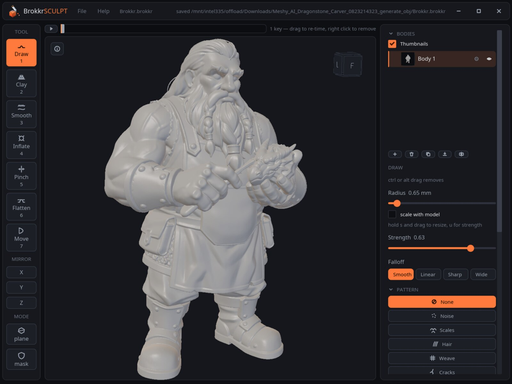
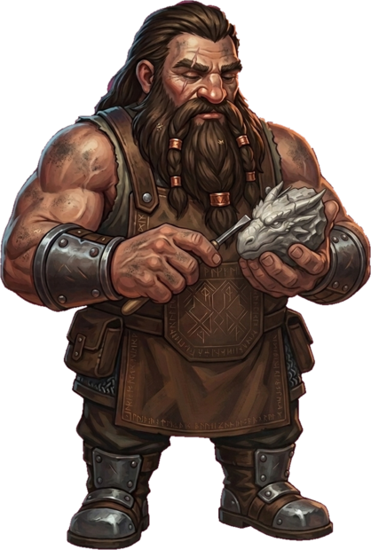
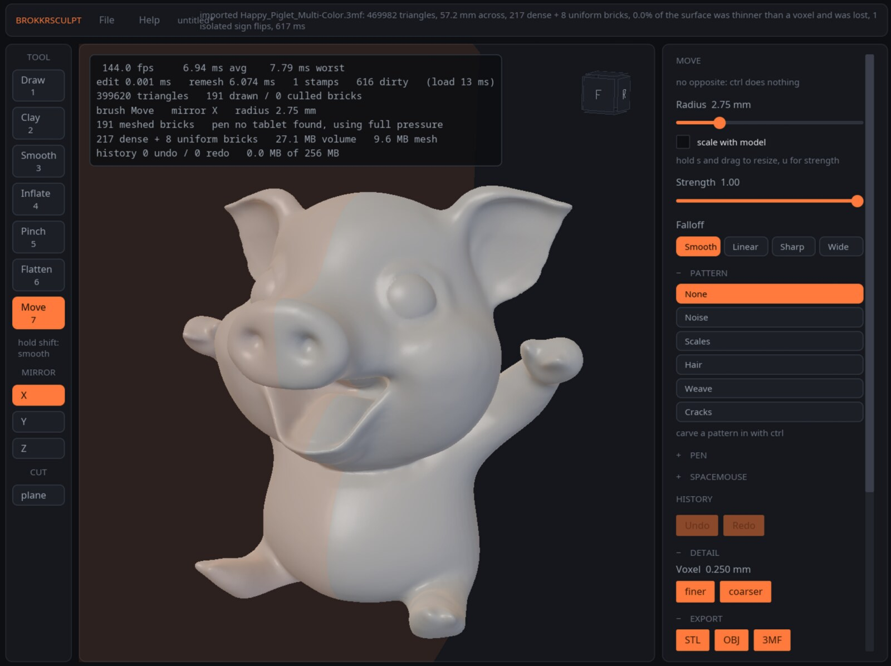
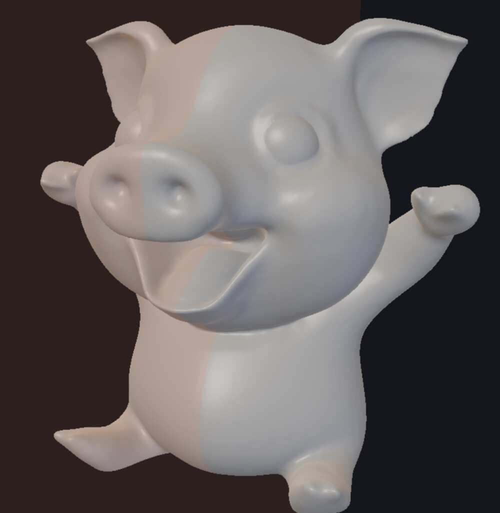
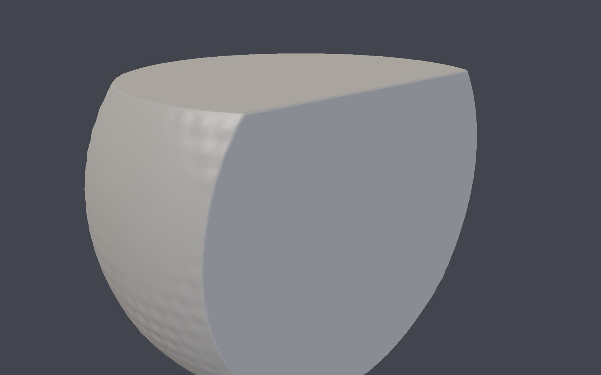
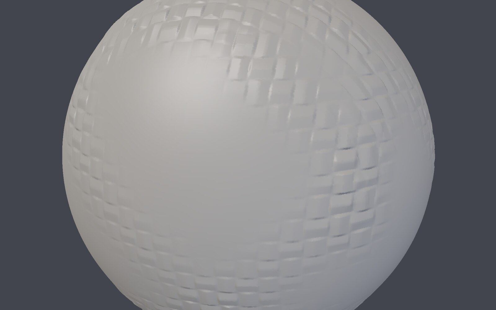
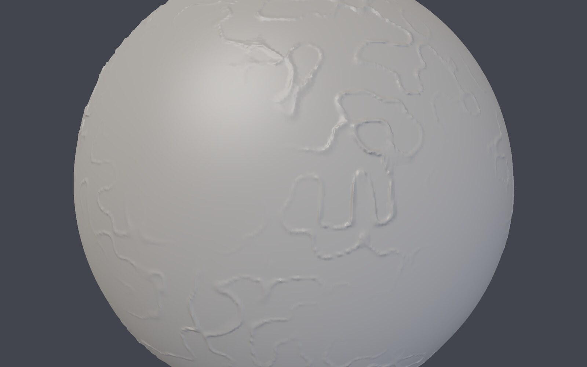
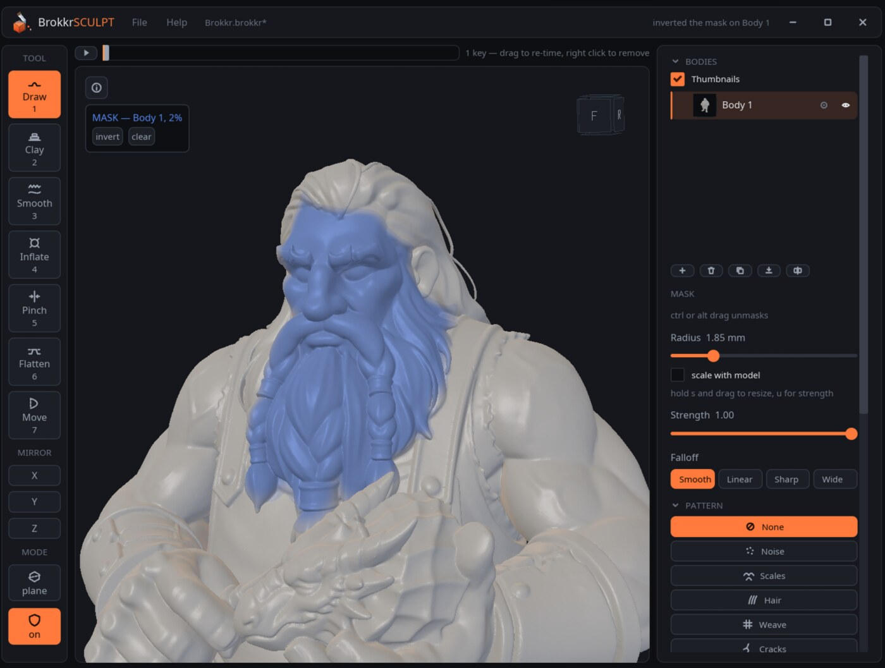

<!-- SPDX-License-Identifier: AGPL-3.0-only -->

<p align="center">
  <picture>
    <source media="(prefers-color-scheme: dark)" srcset="assets/brand/brokkrsculpt-lockup-dark.svg">
    
  </picture>
</p>

<p align="center">
  <strong>Shape it. Print it.</strong><br>
  A sculpting tool for people who print what they make.
</p>

<p align="center">
  <a href="https://github.com/MakerViking/brokkrsculpt/actions/workflows/ci.yml"></a>
  
  
  
</p>

<p align="center">
  
</p>

Start from a ball, a scan, or something you downloaded. Push it around until it
looks right. Send it to your slicer and print it.

That last step is the one most sculpting tools leave to you. BrokkrSculpt
treats it as the point of the exercise: it works in **solid material** rather
than on a hollow surface, so the things that usually go wrong between sculpting
and printing mostly cannot happen here.

- **Eight brushes** — draw, clay, smooth, inflate, pinch, flatten, move and paint, which writes a filament slot for multi-colour printing
- **Symmetry** across any combination of the three axes
- **Surface patterns** — scales, weave, cracks, hair and noise
- **A plane cut** that leaves a closed, printable face
- **Graphics tablet support** — pressure, tilt, and the eraser end
- **Import** STL, OBJ and 3MF, including multi-part project files
- **Copes with broken models** — holes, hollow shells and scanner noise
- **Export** that is checked before it is written, and refused if it would not print
- **One click into OrcaSlicer**

It is free, open source, and **honestly not finished**. It is being built in the
open by one person.

<p align="center">
  <strong><a href="https://github.com/MakerViking/brokkrsculpt/releases/tag/beta">⬇ Download the open beta</a></strong><br>
  <a href="https://github.com/MakerViking/brokkrsculpt/releases/download/beta/BrokkrSculpt-Linux-x86_64.tar.gz">Linux</a> ·
  <a href="https://github.com/MakerViking/brokkrsculpt/releases/download/beta/BrokkrSculpt-Windows-x86_64.zip">Windows</a> ·
  <a href="https://github.com/MakerViking/brokkrsculpt/releases/download/beta/BrokkrSculpt-macOS-arm64.zip">macOS</a><br>
  <sub>Free, no account. Nothing is signed yet, so Windows and macOS will both
  warn you about it: <a href="#get-it">Get it</a> says exactly what to do.
  <a href="#what-works-on-which-platform">What works on which platform</a> says
  where each of the three builds actually stands.</sub>
</p>

> Named for Brokkr, the dwarven smith of Norse myth. Sibling to
> [SindriCAD](https://tinkeratlas.com/sindricad) — Brokkr and Sindri forged
> Mjolnir together. SindriCAD does parametric CAD; BrokkrSculpt does clay.
> There is a [product page](https://tinkeratlas.com/brokkrsculpt) too, if you
> would rather see the pictures first.

<p align="center">
  
</p>

## Why solid material matters

This is the one idea worth understanding, and it explains most of the rest.

A normal 3D model is a **surface** — a shell of triangles with nothing behind
it. That is why models break. A hole in the shell is just a place where the
surface stops, and pulling on a thin part can tear a new one.

BrokkrSculpt works on **solid material** instead. Every point in space knows how
far it is from the edge of the model, so there is no shell to tear and no hole
to leave behind. In practice:

- **You cannot rip a hole in it** by pulling too hard.
- **A cut closes itself.** Slice a solid and you still have a solid.
- **A model that arrives broken usually stops being broken** when it comes in,
  because it is rebuilt as material rather than patched as a surface.

That last one is worth spelling out, because it is the difference between this
and a mesh editor.

## Models that arrive broken

Scans come back with holes where the light did not reach. Downloads turn out to
be a paper-thin skin around nothing. A turntable wobble leaves a lump of noise.

There is no "repair" button here, and that is deliberate — there is nothing to
press because the work happens as the model comes in:

- **Holes mostly stop existing.** Converting a surface into solid material means
  there is no surface left to have a gap in it.
- **Hollow shells are filled.** A skin too thin to hold its shape is made solid,
  so only the outside has to be represented — which also roughly halves the
  model.
- **Scanner artefacts are removed** where they can be *proven* to be artefacts,
  never merely guessed at. Material that no closed surface could have produced
  is deleted; a genuine paper-thin membrane is left alone.
- **It tells you what it did.** The status line reports how much was filled,
  repaired or lost. An auto-fix that quietly guesses is how you find out at the
  printer.

**One honest limit.** A model that is both very thin *and* genuinely open —
a car body with the windows missing, say — cannot be made solid, because there
is no inside to fill. It imports, but it stays fragile. Closing openings
automatically is not built yet.

## See it in action

<p align="center">
  
</p>

A model sculpted years ago in ZBrush, exported as 3MF and imported here:
**469,982 triangles, 57.2 mm across, in 617 ms**, with nothing lost.

<p align="center">
  
</p>

<p align="center">
  
</p>

Drag a line across the model and it cuts, straight through. **The cut face
closes itself**, so what is left still prints.

<p align="center">
  
  
</p>

Patterns are a **modifier on whichever brush you are holding**, not brushes of
their own — so clay-with-scales and inflate-with-hair are both just there,
without a menu of every combination.

## Get it

| Platform | Download |
|---|---|
| **Windows** (64-bit) | [BrokkrSculpt-Windows-x86_64.zip](https://github.com/MakerViking/brokkrsculpt/releases/download/beta/BrokkrSculpt-Windows-x86_64.zip) |
| **macOS** (Apple silicon) | [BrokkrSculpt-macOS-arm64.zip](https://github.com/MakerViking/brokkrsculpt/releases/download/beta/BrokkrSculpt-macOS-arm64.zip) |
| **Linux** (64-bit) | [BrokkrSculpt-Linux-x86_64.tar.gz](https://github.com/MakerViking/brokkrsculpt/releases/download/beta/BrokkrSculpt-Linux-x86_64.tar.gz) |

Those links always point at the newest build, which is rebuilt from `main` on
every change. The app updates itself after that, so this is a one-time
download. If you would rather see the whole release, it is
[here](https://github.com/MakerViking/brokkrsculpt/releases/tag/beta) — the
files named `update-…` there are what the built-in updater fetches, and you
never need one by hand.

[`CHANGELOG.md`](CHANGELOG.md) says what moved since you last looked, which
matters here: the download link never changes, so two people running "the beta"
may not be running the same thing.

Nothing is signed, so both Windows and macOS will warn you about it. Read
[What works on which platform](#what-works-on-which-platform) before you start:
the three builds are not equally finished, and it says so specifically. Signing
is the thing waiting on funding.

Or build it, which is what Linux development does anyway. You need a
**Vulkan-capable GPU** and a Rust toolchain at least as new as the
`rust-version` in the workspace manifest.

```fish
git clone https://github.com/MakerViking/brokkrsculpt
cd brokkrsculpt
cargo run --release -p brokkr-app
```

Two things worth knowing on the way in:

- **Launch it natively on Wayland** if that is your session. On XWayland the
  window can land outside the X screen's bounds, and the compositor then stops
  asking for frames — which looks exactly like a 1 fps bug and is not one.
- **A tablet or SpaceMouse needs the `input` group** on most distributions,
  because both are read from `/dev/input`. Without it neither device is seen and
  nothing else breaks. Log out and back in afterwards:

```fish
sudo usermod -aG input $USER
```

### Controls

| input | action |
| --- | --- |
| left drag | sculpt |
| ctrl left drag | invert the brush |
| hold shift | smooth, whatever brush is selected |
| right or middle drag | orbit |
| shift right drag | pan |
| right click | the current tool's settings, at the cursor |
| wheel | zoom |
| `1`–`7` | select a brush, in the order the strip shows them |
| `x` `y` `z` | toggle a mirror plane |
| `[` `]` | scale the brush radius |
| hold `s`, drag | resize the brush (ZBrush's Draw Size) |
| hold `u`, drag | change strength (ZBrush's Z Intensity) |
| ctrl z, ctrl shift z | undo, redo |
| pen pressure | scales the brush |
| pen eraser end | inverts the brush |
| pen tilt | steers which way the brush pushes |

### Which platforms

**All three, as of the open beta** — with the honest caveat that they are not
equally finished. Linux is where this is built and used every day. Windows and
macOS compile, pass the same suite and are published from the same commit, but
have had far less time in front of real hardware; [What works on which
platform](#what-works-on-which-platform) says exactly where each one stands
rather than leaving you to find out.

**Tablets** — Android and iPad — come after that, because sculpting with a pen
on glass is the right way to do this and there is no good reason a voxel engine
cannot go there. That part is not done. Saying so is not the same as not caring
about it.

## Printing

BrokkrSculpt does not slice, and should not. What it does is hand off cleanly to
the things that do.

- **One click into OrcaSlicer.** *File > Open in OrcaSlicer* exports a 3MF and
  launches the slicer on it. The table of places a slicer might be installed is
  shared with SindriCAD, because every path in it was earned by a real bug
  report.
- **Colour that lands on filament slots.** The 3MF writer paints each triangle
  with a **filament slot number**, not an RGB value — which makes it a print
  instruction rather than a decoration. Verified against OrcaSlicer 2.4.0-alpha:
  a banded model opens with its bands on filaments 1 to 4.
- **Check your printer.** A read-only Moonraker query against a Snapmaker U1 on
  your own network. Put `host = 192.0.2.46` in
  `$XDG_CONFIG_HOME/brokkrsculpt/printer.conf`. Verified against real hardware
  on firmware 1.3.0.168.

Nothing paints those slots by hand yet — that part is designed and not built.

<details>
<summary>Why the 3MF colour is written the "wrong" way</summary>

The 3MF specification has a colour extension, and **the slicers do not read
it.** Measured across two real multi-colour projects there are *zero*
occurrences of `basematerials`, `colorgroup`, `texture2d` or `pid=`. What they
carry instead is `paint_color` per triangle, in the PrusaSlicer-lineage
encoding. Designing to the specification would have produced a file that
validates perfectly and prints in one colour.

</details>

## The bug reporter shows you what it sends

The bug button in the corner of the viewport — or *Help > Report a bug* — files
a report against TinkerAtlas. Three things about it are worth stating plainly,
because you can check every one of them in the source:

- **The dialog shows you the exact payload before it goes**, assembled by the
  same function that sends it — not a description of it.
- **Your home directory is stripped out first.**
- **Anonymous unless you have signed in, and the dialog says which.** Signed
  out, the report carries no account and no credential and there is nothing on
  disk to leak. Signed in, it goes under your name so the report can be replied
  to — and the line above the Send button names you before you press it, rather
  than leaving you to infer it from a sign-in you did on a different screen.

Signing in is optional and exists for one reason: an anonymous report cannot be
answered. Nothing else in the application needs it.

## Masking

Paint over what you want left alone, and every brush stops at it. The tint is
a view, not a material: it says where protection is, and turning it off changes
nothing about what a stroke does.

<p align="center">
  
</p>

Masking scales the brush's effect rather than switching it, so a softly painted
edge gives a soft boundary rather than a cut line, and Move carries a mask along
with the material it displaces instead of leaving it behind in the air.

## Status

Milestones M0 through M3 of [docs/BUILD-SPEC.md](docs/BUILD-SPEC.md) are
complete, and a good deal beyond them. **1411 tests pass**, clippy is at zero
warnings, and three performance gates fail the build if a budget is blown.

**Not there yet:** procedural primitives, painting filament slots by hand, and
signed installers. All on the list rather than ruled out.

### What works on which platform

**This is an open beta and it is not the same beta everywhere.** Linux is where
it is built and used every day; Windows and macOS compile, pass the suite, and
have had far less time on real hardware. Nothing below is a surprise anyone
should have to discover for themselves.

| | Linux | Windows | macOS |
|---|---|---|---|
| Sculpting, import, export, printing | yes | yes | yes |
| Masking **display** | yes | yes | **wrong — see below** |
| Stylus pressure and tilt | yes | untested | untested |
| SpaceMouse | yes | untested | untested |
| Update check, download and verify | yes | yes | yes |
| Replacing itself with the update | yes | untested | untested |
| Installer the OS trusts | n/a | no | no |

- **macOS masking renders wrong.** The tint spreads past the mask and a seam
  shows between bricks. The mask itself is correct — what a brush does is
  unaffected, and so is anything you export — but you cannot trust the blue to
  tell you where it is. A difference in how the Metal backend reads a vertex
  attribute; it is being chased, and Linux and Windows are unaffected.
- **The update SWAP on Windows and macOS has never run on real hardware.** All
  three platforms use the same signed manifest, the same download and the same
  SHA-256 check, and that half has been exercised end to end. What differs is
  the last step: Linux and Windows replace the executable, macOS replaces the
  whole `.app`. Only the Linux one has actually been performed. Both of the
  others keep the build they replaced and write a `RECOVER-BROKKRSCULPT.txt`
  beside the application saying how to put it back, and
  `BROKKR_NO_SELF_UPDATE=1` downloads and verifies without installing — which
  is what to set if you would rather not be the first.
- **Stylus and SpaceMouse on Windows and macOS are written but have never met
  the hardware.** Windows reads them through Raw Input, macOS through IOKit,
  and both compile on their own platform — but nobody involved owns a tablet or
  a puck on either, so "it works" is not a claim being made. Both panels say
  which state they are in rather than leaving you guessing:

  > *"Listening for a pen through Raw Input; none has reported yet"* — against —
  > *"Reading the pen through Raw Input."*

  If it never leaves the first, strokes run at full pressure exactly as a mouse
  does, so it degrades rather than breaks. **A screenshot of that panel is the
  single most useful bug report a Windows or macOS user with a tablet can
  send.** On macOS, silence most often means Input Monitoring has not been
  granted in System Settings → Privacy & Security.
- **Neither installer is signed**, because the certificates cost money this
  project does not have yet.

  **macOS** will say the app *"is damaged and can't be opened."* It is not
  damaged — that is what Gatekeeper says about any unsigned download. Move it
  to Applications, then in Terminal:

  ```
  xattr -dr com.apple.quarantine /Applications/BrokkrSculpt.app
  ```

  The Terminal command rather than the usual advice, deliberately. Control+click
  → Open **no longer works**: Sequoia removed it. The supported route is now
  System Settings → Privacy & Security → **Open Anyway** after a failed launch,
  which needs an admin password and only offers the button for about an hour
  afterwards — and an app with no signature at all may not appear there to be
  excused. Removing the quarantine flag is the one path that does not depend on
  any of that. It turns off nothing system-wide; it marks this one download as
  one you chose.

  **Windows** shows SmartScreen's *"Windows protected your PC"*, which needs
  **More info** then **Run anyway**.

**The honest limits**, both of which you will meet in ordinary use rather than
in exotic corner cases:

- **Very thin, genuinely open shells** cannot be made solid, as above.
- **Fine detail on a large model is limited.** Resolution is uniform, so a brush
  narrower than about three voxels has nowhere to put what it is drawing, and
  halving the voxel size to make room roughly quadruples the triangle count. A
  big model sculpts happily at broad scale and resists fine detail. The finest
  setting is 0.03 mm, which is below what a resin printer resolves.

---

Everything past this point is for people who want to know how it works.

## How it works

All figures on a Radeon RX 6900 XT and a Ryzen 9 7900X.

The model is a **sparse grid of 32³ voxel bricks**, each storing distance to the
surface, with distances clamped to a narrow band a few voxels either side.
Empty space and solid interior both cost nothing, because a brick that is
uniformly one or the other is stored as a single value.

The property the whole design protects: **work is proportional to what the brush
touched, never to the size of the model.** An average stroke step remeshes about
13 bricks out of 6056.

### Measured performance

**Per stamp, at a 20 mm brush radius on a 0.25 mm voxel** — the largest brush the
interface offers. The ceiling is measured rather than chosen: the slider stops
at 20 mm because 25 mm failed the fast-drag row and 30 mm was refused outright.

| brush | per stamp at 20 mm |
| --- | --- |
| flatten | 1.03 ms |
| inflate | 1.38 ms |
| clay | 1.39 ms |
| move | 3.31 ms |
| draw | 3.75 ms |
| pinch | 4.03 ms |

Draw and pinch are the most expensive because they resample the field through
trilinear interpolation, which is honest work rather than waste.

**At a 60 mm ball on a 0.055 mm voxel**, which is 1090 cubed effective:

| | measured | budget |
| --- | --- | --- |
| triangles | 11,216,268 | 10 million |
| brush edit, one stamp | 2.63 ms | 4 ms |
| dirty remesh, 64 bricks | 0.86 ms | 8 ms |
| render, all 5435 bricks drawn | 1.13 ms | 16 ms |
| volume plus mesh | 1027 MB | well under 3 GB |

`cargo bench -p brokkr-core` is a **gate, not a report** — it exits non-zero when
a budget is blown, and the build fails with it. Measure on an idle machine: the
fast-drag row sits close enough to its budget that a busy desktop decides it.

### Brushes

| brush | what it does to the field |
| --- | --- |
| Draw | translates the patch along the stroke normal |
| Clay | blends toward a plane held just outside the surface, adding only |
| Smooth | blends toward the average of the neighbouring values |
| Inflate | offsets the level set, moving every point along its own normal |
| Pinch | squeezes the field toward the brush axis, sharpening ridges |
| Flatten | blends toward the tangent plane under the cursor |
| Move | grabs the material and pulls it with the pointer |

Smooth and flatten have no opposite, so inverting them does nothing and the
interface says so.

Draw and pinch were both first written the obvious way — as a value the brush
adds or amplifies — and both had to be rewritten. Anything with gain above one
turns its own rounding error into visible crust over a stroke. Both now resample
the field from a shifted position instead, which cannot introduce detail that
was not already there.

**Move is not a stamping brush.** It snapshots the field when the gesture begins
and re-applies the warp from the *total* drag on every pointer event, rather
than integrating per-stamp increments. Its target is the pointer projected into
the view plane through the grab point, never a raycast onto the surface — a
raycast target crawls along the form, so dragging sideways across a ball dimples
it instead of pulling it. The first version was incremental and moved the
surface 0.02 mm; that failure and the two rejected fixes are recorded in the
source.

### Export is checked, not assumed

**STL**, **OBJ** and **3MF**, to a path you choose. World units are millimetres
throughout. **Exports are Z-up** — the sculpt world is Y-up and the printing
world reads these formats as Z-up, so both directions are rotated at the one
boundary that knows about it. Confirmed against the real slicer: a fixture 40 mm
tall in sculpt Y comes back from `OrcaSlicer --info` as `size_z = 39.96,
manifold = yes`.

<details>
<summary>Why watertightness needs a weld, and why it keys on cells</summary>

Bricks are meshed independently, so the vertices along every brick seam exist
twice. That makes the renderer's job easy and a printer's impossible: a slicer
reads two coincident vertices as two surfaces with a crack between them.

Export welds those duplicates, drops the triangles that collapse to nothing, and
counts what it produced. A closed surface has every edge shared by exactly two
triangles; an edge used once is a hole. **The application refuses to write a file
that would not print.**

Welding keys on the lattice cell each vertex came from, not on its position.
That distinction is load bearing and was found the hard way: two bricks compute
the same seam vertex from the same corner values but at different intermediate
magnitudes, so the results differ in the last bits. Any scheme that rounds a
position onto a grid splits such a pair whenever they straddle a boundary —
about one vertex in a hundred, which left 576 holes in a model that looked
perfect on screen. Surface nets puts at most one vertex per lattice cell, and
both bricks derive that cell from the same world coordinate, so keying on it is
exact and needs no tolerance.

</details>

### Detail and resampling

Resolution is uniform and fixed, which is what keeps the sculpt loop's cost
predictable. Getting finer detail means resampling the whole field onto a finer
lattice — a deliberate button rather than something a brush does.

The **finer** and **coarser** buttons halve and double the voxel size, down to
0.03 mm. The GPU mesh pool holds 11 million vertices and grows across up to
eight buffer pairs as needed, because `wgpu`'s default `max_buffer_size` caps a
single buffer at 256 MiB; the binding limit is now system RAM rather than the
GPU.

Two things a resample has to get right, both with tests. Distances are stored in
voxels rather than world units, so they are rescaled by the ratio of the two
sizes — copying them across unchanged would move the surface. And empty and
solid regions are recognised from the brick structure without sampling anything,
so resampling a solid ball does not allocate its whole interior.

### Stylus

Pressure works with any tablet the Linux kernel has a driver for. There is no
vendor list and no per-device configuration: a stylus is any input device
reporting both `ABS_PRESSURE` and `BTN_TOOL_PEN`. Each device's own range is read
from the device, so a Huion reporting 8191 levels and a Wacom reporting 2047
both normalise correctly.

It is read straight from evdev rather than from the window system. That is not a
shortcut: iced 0.14's touch events carry only a position and drop winit's `force`
field, and winit 0.30 never had force for pens at all. Reading evdev also means
one code path covers X11, XWayland and Wayland.

**The eraser end** inverts the brush, the same as the modifier key. The two
combine rather than override. The kernel reports tip and eraser as separate
tools that are never in range together — anything checking only for the tip
treats every eraser stroke as a mouse and quietly runs it at full pressure.

**Tilt** rotates the direction the brush pushes, up to sixty degrees, and steers
every brush at once because they all work from the same stroke normal. Leaning
also reduces how far the brush pushes out, by the cosine of the angle, which is
what makes a leaned stroke feel glancing.

The **PEN** panel names the tablet it found, shows its pressure range, and gives
a live reading — enough to confirm a tablet works in seconds. If it says no
tablet was found:

```fish
cargo run --release -p brokkr-app -- --tablets
```

Windows and macOS fall back to full pressure; those need Pointer Input or Wintab
and `NSEvent` respectively.

### SpaceMouse

A 3Dconnexion puck drives pan, zoom, orbit and roll. All six axes and both
buttons are rebindable, settings persist, and the panel has a live per-axis
readout.

Detection is a **capability rule** — all six of `REL_X` through `REL_RZ` — not a
vendor id. That is strictly stronger: mice and keyboards report two relative
axes and a SpaceNavigator reports six, and it cannot repeat the bug where a
Logitech mouse was taken for a puck because Logitech also owns `0x046d`.

```fish
cargo run --release -p brokkr-app -- --spacemouse
```

### The icon set

Twenty-one icons on a 24×24 grid, drawn as canvas paths. The files in
`assets/icons/` are **generated** from the drawings in
`crates/brokkr-app/src/icon.rs`, so they cannot drift from what the application
draws; `docs/icons.html` shows the whole set at the three sizes it ships at.

Rendering them as SVG at run time would have cost 31 crates. Drawing them as
canvas paths costs 6.

## Checking it

```fish
cargo test --workspace     # 1316 tests
cargo bench -p brokkr-core # budget gate; exits non-zero when one is blown
```

The tests worth knowing about:

- **`brokkr-core/tests/seams.rs`** asserts the union of the per-brick meshes is
  closed after every brush and every pattern has been dragged across brick
  corners. This is the crack test. It ships a control that proves it can detect
  a gap.
- **`brokkr-gpu/tests/offscreen.rs`** renders to a texture with no window and
  checks the pixels. This is the only thing that catches the class of bug that
  compiles, passes every numeric test, and looks wrong — which has now happened
  three times.
- **`brokkr-core/tests/hostile_meshes.rs`**, and fuzzes inside the 3MF and
  project readers, corrupt a valid file thousands of ways and require that every
  input gets an *answer*. **Each ships a control** counting how far the mutants
  got, so a reader that refused everything at its magic bytes cannot pass
  silently. They found a brick-coordinate overflow the targeted tests missed.
- **`tablet.rs` and `spacemouse.rs`** each build a **synthetic device with
  uinput** and let the ordinary scanner find it through `/dev/input`, so the same
  code path runs as for real hardware. Nothing in them is a mock.
- **`export.rs`** asserts that seeded, sculpted, carved and patterned models all
  export watertight and manifold, and ships the counterparts that prove the
  check can fail.

To look at what the offscreen tests rendered:

```fish
env BROKKR_DUMP_FRAMES=/tmp cargo test -p brokkr-gpu --test offscreen
```

[`docs/`](docs/) is the long version: the build spec and the budgets it holds
the sculpt loop to, how to drive the running application when a test cannot
reach what you changed, and the design behind the cut tool and the updater.
They record what was tried and rejected alongside what shipped, including
optimisations that were implemented, measured and then reverted, which is
usually a faster way in than the code.

## AI assistance

I build this with AI assistance. Code, tests, docs.

I direct it and review what comes out. Every change passes the same gates
whatever wrote it: `cargo fmt`, `cargo clippy` with `-D warnings`, the full
test suite, and a performance benchmark that exits non-zero when a budget is
blown. No exceptions.

The reasoning lives in the repo rather than in my head. Commit messages record
what was tried and rejected, and [`docs/`](docs/) carries the design documents.
Judge it on that.

## Layout

```
crates/brokkr-core/   volume, bricks, brushes, patterns, meshing, undo, import, export.
                      No UI, no windowing, no GPU.
crates/brokkr-gpu/    wgpu resources, mesh pool, sculpt pipeline, overlay, frustum.
                      No UI toolkit.
crates/brokkr-app/    iced shell, input, tablet, spacemouse, camera, tools, viewport.
```

`brokkr-core` staying free of UI and GPU dependencies is what keeps the shell
choice reversible. CI fails the build if `iced`, `winit`, `wgpu`, `egui`,
`tauri` or `raw-window-handle` ever appears in its tree.

<details>
<summary>Two optimisations, and one the measurements talked us out of</summary>

**The big brushes cost their surface, not their box.** `edit_voxels` used to
visit every voxel in the brush's bounding box — over four million at a 20 mm
radius and a 0.25 mm voxel, nearly all saturated interior or exterior where the
edit is a no-op. Bricks are now classified before anything is touched. Draw at
20 mm went from **12.8 ms to 3.9 ms**, from three times over budget to inside
it. The equivalence test asserts the resulting field *before* it asserts that
anything was skipped: skipping that changes the sculpt is a bug, skipping that
saves nothing is only a missed optimisation, and the test says which.

**M2 was met without compute shaders.** The build spec planned to move both the
SDF edits and the meshing to wgpu compute, with a GPU brick pool and a page
table. Measuring first showed that was not what stood in the way. At the target
size the CPU path had exactly one problem: a brush edit took 13.9 ms against a
4 ms budget. Meshing across cores took a full mesh from 2547 ms to 233 ms;
editing across cores took one stamp from 13.9 ms to 2.6 ms. Two things the plan
called for turned out not to be needed — drawing all 5435 bricks individually
costs 1.13 ms, so per-brick batching would buy nothing, and 16-bit distances
would halve a volume already inside a third of its ceiling. There is also an
argument against moving only the edits: with meshing on the CPU, GPU edits would
need a read back every stamp, and waiting for the GPU costs more than the edit
saved. The compute route remains right for scales far beyond this, and the CPU
path is a working reference to check it against.

</details>

## Licence

AGPL-3.0-only. See [LICENSE](LICENSE).

Every dependency is permissively licensed — 305 crates, all MIT, Apache-2.0,
BSD, ISC, Zlib, Unlicense, CC0, CDLA-Permissive or Unicode-3.0. Exactly one
names the GPL at all: `self_cell` is `Apache-2.0 OR GPL-2.0-only`, a choice,
and it is taken under Apache-2.0. Nothing about the AGPL here is inherited.
[NOTICE.md](NOTICE.md) has the full accounting and how to re-check it.

Contributions are welcome under an inbound-relicensing grant; see
[CONTRIBUTING.md](CONTRIBUTING.md). For anything security-sensitive, see
[SECURITY.md](SECURITY.md) rather than the issue tracker.
