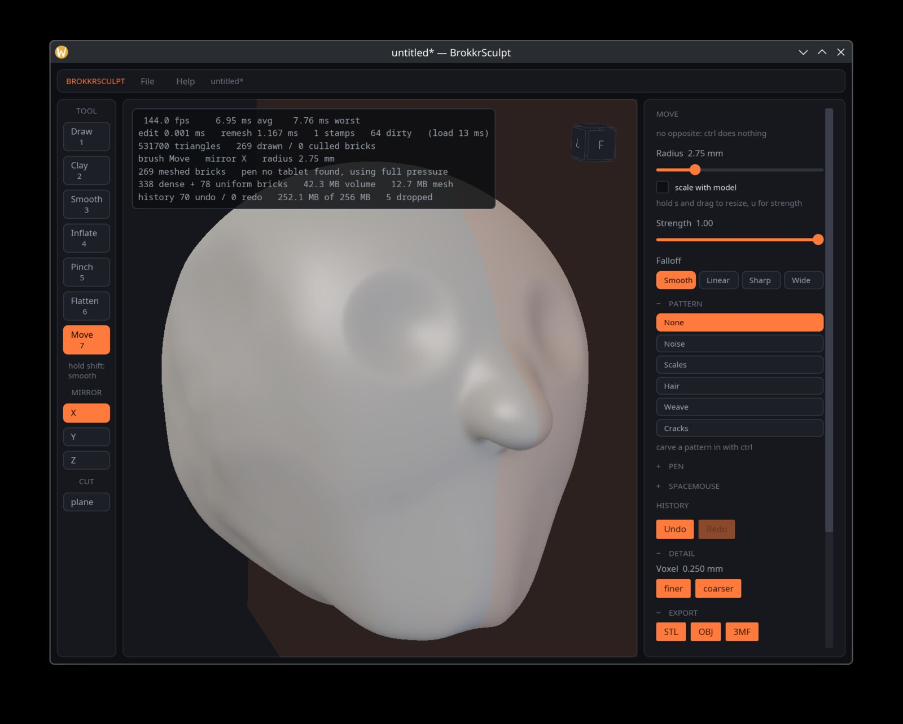

<!-- SPDX-License-Identifier: AGPL-3.0-only -->

<h1 align="center">BrokkrSculpt</h1>

<p align="center">
  <strong>Voxel sculpting for 3D printing.</strong><br>
  Import a scan, cut the bad parts away, sculpt what is left,<br>
  and export something that actually slices.
</p>

<p align="center">
  <a href="https://github.com/MakerViking/brokkrsculpt/actions/workflows/ci.yml"></a>
  
  
  
</p>

<p align="center">
  
</p>

---

**This one started with a scan that came out wrong.** Anyone who has pointed a
scanner at a real object knows the result: holes where the light did not reach,
a shell that is not quite closed, a lump of noise where the turntable moved.
Mesh tools will let you push vertices around it, and every push is a chance to
tear something that was already fragile.

BrokkrSculpt does not work on the mesh. It works on a **signed distance field**,
which is a fancy way of saying it works on solid material rather than on a
surface. You cannot tear a hole in it by pulling too hard, and a cut through it
closes itself, because a solid with a slice taken out of it is still a solid.
That is the whole reason to build a sculpting tool this way when what comes out
of it has to be printed.

It is **Linux first**, it is free and open source, and it is **honestly not
finished**. It is being built in the open by one person.

Sibling to [SindriCAD](https://tinkeratlas.com/sindricad). Brokkr and Sindri
forged Mjolnir together; SindriCAD does parametric CAD, BrokkrSculpt does clay.
Nomad Sculpt ships for Windows and macOS but not Linux, and that gap is why this
exists — it is why Linux comes first and stays first.

## See it in action

<p align="center">
  
</p>

A model sculpted years ago in ZBrush, exported as 3MF and imported here:
**469,982 triangles, 57.2 mm across, in 617 ms**, with nothing lost to the voxel
grid. The status line says so, including how much of the surface was thinner
than a voxel — it reports what it did rather than claiming success.

<p align="center">
  
</p>

<p align="center">
  
</p>

Drag a line across the model and it cuts, straight through. **The cut face
closes itself**, so what is left still prints. On a distance field that is one
`max` operation, where a mesh tool needs boolean surgery to get the same result.

<p align="center">
  
  
</p>

Surface patterns are a **modifier on whichever brush you are holding**, not
brushes of their own. Feature size is measured in voxels, so a pattern cannot
ask for detail finer than the model can carry.

## What it does

**Import a scan and see what is wrong.** STL, OBJ and 3MF come in and become
solid material. Defects are shown, not quietly repaired: an auto-fix that
guesses is how you find out at the printer. Sealed cavities *are* filled,
because a hollow skin a voxel thick cannot be held as a distance field at all,
and the fill is reported when it happens.

**Cut, and keep something printable.** Drag a line and a plane cuts through the
whole model, exactly, with the cut face closed.

**Brushes that behave.** Draw, clay, smooth, inflate, pinch, flatten and move,
with pressure and tilt from a graphics tablet, and mirroring across any
combination of the three axes.

**Detail you can actually print.** Scales, weave, cracks, hair and noise press
into the surface as real geometry, clamped so they can never ask for a feature
finer than the voxel size can hold.

**Export that is checked before it is written.** STL, OBJ and 3MF out, in
millimetres and the right way up, and **refused rather than written** if the
model would arrive at a slicer full of holes.

**Fast enough to feel like clay.** A sparse voxel structure, so empty and solid
space both cost nothing, and a hard per-stroke time budget that the build fails
if it exceeds. Eleven million triangles draw in about a millisecond.

Also: a project format with autosave and a recent-files list, a timeline of
camera keys, a navigation cube that can re-orient the *model* so it lands
upright on the plate, and a 3Dconnexion SpaceMouse driving the view.

## The Snapmaker U1 pipeline

BrokkrSculpt does not slice, and should not. What it does instead is hand off
cleanly to the things that do.

- **One-click hand-off to OrcaSlicer.** *File > Open in OrcaSlicer* exports a
  3MF to a staging path and launches the slicer on it. The table of places a
  slicer might be installed is shared with SindriCAD, because every path in it
  was earned by a real field report.
- **Multi-material colour that lands on filament slots.** The 3MF writer emits
  per-triangle `paint_color` in the encoding the PrusaSlicer-lineage slicers
  actually read, plus the model and project settings parts. Verified against
  OrcaSlicer 2.4.0-alpha: a banded model opens with its bands on filaments 1 to
  4 and the rest on the base filament. Colour is a **filament slot number**, not
  an RGB value, which is what makes it a print instruction rather than a
  decoration.
- **Print monitoring over Moonraker.** *Check the printer* queries a U1 on your
  own LAN, read only. Put `host = 192.0.2.46` in
  `$XDG_CONFIG_HOME/brokkrsculpt/printer.conf`. Verified against real hardware
  on firmware 1.3.0.168.

A note on why the 3MF colour is done the way it is: the 3MF specification has a
colour extension, and **the slicers do not read it**. Measured across two real
multi-colour projects there are *zero* occurrences of `basematerials`,
`colorgroup`, `texture2d` or `pid=`. Designing to the specification would have
produced a file that validates perfectly and prints in one colour.

## The bug reporter shows you what it sends

*Help > Report a bug* files a report against TinkerAtlas. Three things about it
are worth stating plainly in an open-source application, because you can check
every one of them in the source:

- **The dialog shows you the exact payload before it goes**, assembled by the
  same function that sends it — not a description of the payload.
- **Everything passes through path redaction first**, so your home directory
  does not travel with it.
- **There is no account and no stored credential.** The report is anonymous.
  SindriCAD attaches a bearer token when it has one cached; this deliberately
  has no sign-in at all, which leaves nothing on disk to leak.

## Get it

**There is no release build.** No installer, no AppImage, no package. A signed,
packaged build is the specific thing waiting on funding; until it exists,
running BrokkrSculpt means building it.

You need Linux, a **Vulkan-capable GPU**, and a Rust toolchain at least as new
as the `rust-version` in the workspace manifest.

```fish
git clone https://github.com/MakerViking/brokkrsculpt
cd brokkrsculpt
cargo run --release -p brokkr-app
```

Launch it **natively on Wayland** if that is your session. Running it on
XWayland can put the window outside the X screen's bounds, at which point the
compositor stops requesting frames — which reads as a 1 fps bug and is not one.

Reading a graphics tablet or a SpaceMouse means reading `/dev/input`, which
needs the `input` group on most distributions. Without it neither device is
seen; nothing else breaks. Log out and back in afterwards:

```fish
sudo usermod -aG input $USER
```

### Controls

| input | action |
| --- | --- |
| left drag | sculpt |
| ctrl left drag | invert the brush |
| hold shift | smooth, whatever brush is selected |
| right or middle drag | orbit |
| shift right drag | pan |
| right click | the current tool's settings, at the cursor |
| wheel | zoom |
| `1`–`7` | select a brush, in the order the strip shows them |
| `x` `y` `z` | toggle a mirror plane |
| `[` `]` | scale the brush radius |
| hold `s`, drag | resize the brush (ZBrush's Draw Size) |
| hold `u`, drag | change strength (ZBrush's Z Intensity) |
| ctrl z, ctrl shift z | undo, redo |
| pen pressure | scales the brush |
| pen eraser end | inverts the brush |
| pen tilt | steers which way the brush pushes |

## Status

Milestones M0 through M3 of [docs/BUILD-SPEC.md](docs/BUILD-SPEC.md) are
complete, and a good deal beyond them. **585 tests pass**, clippy is at zero
warnings, and three separate performance gates hold.

What is *not* there: masking, procedural primitives, a packaged build, and
Windows or macOS. Those are intended rather than promised.

**One known defect is worth stating up front, because it is the case the
application exists for.** A large, badly defective scan can exhaust the GPU mesh
pool, and the model then quietly loses parts of itself on screen. A noisy
scanned surface carries several times more geometry per brick than a sculpted
one, and the pool is sized for the sculpted case. Coarsening the voxel size
works around it today. Every measurement below was taken on sculpted geometry
and shares that blind spot.

All figures on a Radeon RX 6900 XT and a Ryzen 9 7900X.

**Per stamp, at a 20 mm brush radius on a 0.25 mm voxel** — the largest brush
the interface offers, which is the worst case the engine has to hold. The
ceiling is measured rather than chosen: the slider stops at 20 mm because 25 mm
failed the fast-drag row and 30 mm was refused outright.

| brush | per stamp at 20 mm |
| --- | --- |
| flatten | 1.03 ms |
| inflate | 1.38 ms |
| clay | 1.39 ms |
| move | 3.31 ms |
| draw | 3.75 ms |
| pinch | 4.03 ms |

Draw and pinch are the two most expensive because they resample the field
through trilinear interpolation, which is honest work rather than waste.

**At the largest model the engine supports**, a 60 mm ball at a 0.055 mm voxel,
which is 1090 cubed effective:

| | measured | budget |
| --- | --- | --- |
| triangles | 11,216,268 | 10 million |
| brush edit, one stamp | 2.63 ms | 4 ms |
| dirty remesh, 64 bricks | 0.86 ms | 8 ms |
| render, all 5435 bricks drawn | 1.13 ms | 16 ms |
| volume plus mesh | 1027 MB | well under 3 GB |

An average stroke step remeshes about 13 bricks out of 6056, which is the
property the whole design exists to protect: **work is proportional to what the
brush touched, never to the size of the model.**

`cargo bench -p brokkr-core` is a **gate, not a report** — it exits non-zero
when a budget is blown, and the build fails with it.

### The big brushes cost their surface, not their box

`edit_voxels` used to visit every voxel in the brush's bounding box, which is
over four million at a 20 mm radius and a 0.25 mm voxel — and nearly all of them
are saturated interior or exterior where the edit is a no-op. Bricks are now
classified before anything is touched. Draw at a 20 mm radius went from
**12.8 ms to 3.9 ms**, from three times over budget to inside it.

The equivalence test asserts the resulting field *before* it asserts that
anything was skipped. Skipping that changes the sculpt is a bug; skipping that
saves nothing is only a missed optimisation, and the test says which is which.

### M2 was met without compute shaders

The build spec's plan for M2 was to move both the SDF edits and the meshing to
wgpu compute, with a GPU brick pool and a page table. Measuring first showed
that was not what stood in the way, and it is worth recording why the code does
not look like the plan.

At the target size the CPU path had exactly one problem: a brush edit took
13.9 ms against a 4 ms budget, because a brush covers a fixed world radius and
so touches cubically more voxels as the voxel size shrinks. Meshing and memory
were already inside their budgets. Two changes fixed it:

- Meshing across cores took a full mesh from 2547 ms to 233 ms and a stroke's
  remesh from 5.6 ms to under 1 ms. Bricks are independent and meshing only
  reads, so this is close to free parallelism.
- Editing across cores, above a work threshold, took one stamp from 13.9 ms to
  2.6 ms.

Two things the plan called for turned out not to be needed. Drawing all 5435
bricks individually costs 1.13 ms, so per brick batching would buy nothing. And
16 bit distance values would halve a volume that already fits in a third of its
ceiling.

There is also an argument against moving only the edits: with meshing on the CPU,
GPU edits would need a read back every stamp, and waiting for the GPU costs more
than the edit saved. The compute route is close to all or nothing, and its one
justification has gone. It remains the right answer for scales far beyond this,
and the CPU path is a working reference to check it against when that time comes.

## Brushes

| brush | what it does to the field |
| --- | --- |
| Draw | translates the patch along the stroke normal |
| Clay | blends toward a plane held just outside the surface, adding only |
| Smooth | blends toward the average of the neighbouring values |
| Inflate | offsets the level set, moving every point along its own normal |
| Pinch | squeezes the field toward the brush axis, sharpening ridges |
| Flatten | blends toward the tangent plane under the cursor |
| Move | grabs the material and pulls it with the pointer |

Smooth and flatten have no opposite, so inverting them does nothing and the
interface says so.

Draw and pinch were both first written the obvious way, as a value the brush
adds or amplifies, and both had to be rewritten. Anything that multiplies a
displacement by the local gradient, or amplifies the difference from a local
average, has gain above one somewhere and turns its own rounding error into
visible crust over a stroke. Both now resample the field from a shifted
position instead, which cannot introduce detail that was not already there.

**Move is not a stamping brush**, and the difference matters. It snapshots the
field when the gesture begins and re-applies the warp from the *total* drag on
every pointer event, rather than integrating per-stamp increments. Its target is
the pointer projected into the view plane through the grab point, never a
raycast onto the surface — a raycast target crawls along the form, so dragging
sideways across a ball dimples it instead of pulling it. The first version was
incremental and moved the surface 0.02 mm; the failure and the two rejected
fixes are recorded in the source.

## Export

**STL**, **OBJ** and **3MF**, to a path you choose. World units are millimetres
throughout, so nothing is converted on the way out. STL and OBJ carry no unit
information and every slicer assumes millimetres for them; 3MF states it
outright, which is the main reason to prefer it.

**Exports are Z-up.** The sculpt world is Y-up and the printing world reads
these formats as Z-up, so both directions are rotated at the one boundary that
knows about it. Confirmed against the real slicer rather than only against our
own tests: a fixture 40 mm tall in sculpt Y comes back from
`OrcaSlicer --info` as `size_z = 39.96, manifold = yes` — upright on the plate.

### Watertight is checked, not assumed

Bricks are meshed independently, so the vertices along every brick seam exist
twice. That is what makes the renderer's job easy and a printer's impossible: a
slicer reads two coincident vertices as two surfaces with a crack between them.

Export therefore welds those duplicates, drops the triangles that collapse to
nothing in the process, and then counts what it produced. A closed surface has
every edge shared by exactly two triangles; an edge used once is a hole. Holes
are counted, and **the application refuses to write a file that would not
print** rather than leaving that to be discovered after a failed job.

Welding is done on the lattice cell each vertex came from, not on its position.
That distinction is load bearing and was found the hard way: two bricks compute
the same seam vertex from the same corner values but at different intermediate
magnitudes, so the results differ in the last bits. Any scheme that rounds a
position onto a grid splits such a pair whenever they straddle a boundary, which
happened to roughly one vertex in a hundred and left 576 holes in a model that
looked perfect on screen. Surface nets puts at most one vertex in each lattice
cell, and both bricks derive that cell from the same world coordinate, so keying
on it is exact and needs no tolerance at all.

## Detail

Resolution is uniform and fixed, which is what keeps the sculpt loop's cost
predictable. Getting finer detail therefore means resampling the whole field onto
a finer lattice, which is a deliberate button rather than something a brush does.

The **finer** and **coarser** buttons halve and double the voxel size. They stop
at 0.06 mm, which is where the mesh pool has been measured to hold the result: a
60 mm ball at 0.055 mm is 11.2 million triangles and 6.2 million vertices against
a pool of 8 million, and going further would put an incomplete model on screen.

Two things a resample has to get right, both of which have tests. Distance values
are stored in voxels rather than world units, so they are rescaled by the ratio of
the two sizes; copying them across unchanged would move the surface. And empty and
solid regions are recognised from the brick structure without sampling anything,
so resampling a solid ball does not allocate its whole interior.

## Stylus pressure

Pressure works with any tablet the Linux kernel has a driver for. There is no
vendor list and no per device configuration: a stylus is any input device that
reports both `ABS_PRESSURE` and `BTN_TOOL_PEN`, which every tablet driver sets.
Each device's own pressure range is read from the device, so a Huion reporting
8191 levels and a Wacom reporting 2047 both normalise correctly.

It is read straight from the kernel's evdev interface rather than from the
window system. That is not a shortcut: iced 0.14's touch events carry only a
position and drop winit's `force` field, and winit 0.30 never had force for pens
at all. Reading evdev also means one code path covers X11, XWayland and Wayland,
because it sits below all three.

### The eraser end

Flipping the stylus over inverts the brush, the same as holding the modifier
key. The two combine rather than override, so holding the modifier while using
the eraser gives the additive brush back. Brushes with no opposite, smooth and
flatten, ignore both.

The kernel reports the tip and the eraser as separate tools that are never in
range at the same time, which is worth knowing: anything checking only for the
tip treats every eraser stroke as a mouse and quietly runs it at full pressure.

### Tilt

Leaning the pen rotates the direction the brush pushes in, up to sixty degrees.
That steers every brush at once, because they all work from the same stroke
normal: draw pushes clay sideways, the clay and flatten planes tip over so a
surface can be flattened at an angle, and pinch's axis leans with the pen.

Leaning also reduces how far the brush pushes outward, by the cosine of the
angle, which is what makes a leaned stroke feel like a glancing one.

Tilt arrives in the tablet's frame, which lines up with the screen, and is
carried into world space through the camera. Positive tilt on the second axis
is taken to mean the pen is leaning toward you, and so toward the bottom of the
screen. If steering comes out mirrored on some tablet, that convention is a
single sign in `pen_lean`.

### Checking a tablet

The **PEN** panel names the tablet it found, shows the device's pressure range
and whether it has tilt and an eraser, and gives a live reading of pressure,
tilt and which end of the pen is in range. That is enough to confirm a tablet
is working in a few seconds rather than guessing from how the brush feels. If
it says no tablet was found, this prints every input device and why each was
accepted or rejected:

```fish
cargo run --release -p brokkr-app -- --tablets
```

The **Curve** slider shapes the response: below 1 makes light touches bite
harder, above 1 gives finer control at the light end.

Windows and macOS fall back to full pressure. Those need Pointer Input or Wintab
and `NSEvent` respectively, and both are milestones away.

## SpaceMouse

A 3Dconnexion puck drives pan, zoom, orbit and roll. All six axes and both
buttons are freely rebindable, the settings persist, and the panel has a live
per-axis readout so a mis-mapped axis takes seconds rather than a rebuild.

Detection is a **capability rule** — all six of `REL_X` through `REL_RZ` — not a
vendor id. That is strictly stronger: mice and keyboards report two relative
axes and a SpaceNavigator reports six, and it cannot repeat the bug where a
Logitech mouse was taken for a puck because Logitech also owns `0x046d`.

```fish
cargo run --release -p brokkr-app -- --spacemouse
```

## Checking it

```fish
cargo test --workspace     # 585 tests
cargo bench -p brokkr-core # budget gate; exits non-zero when one is blown
```

The tests worth knowing about:

- `crates/brokkr-core/tests/seams.rs` asserts the union of the per brick meshes
  is closed, every edge shared by exactly two triangles, after every brush and
  every pattern has been dragged across brick corners. This is the crack test.
  It ships with a control that proves it can detect a gap.
- `crates/brokkr-gpu/tests/offscreen.rs` renders to a texture with no window and
  checks the pixels. This is the only thing that catches the class of bug that
  compiles, passes every numeric test, and looks wrong — which has now happened
  three times. It renders each brush and each pattern in turn and asserts no two
  patterns render alike, since two identical frames would mean one never reached
  the field.
- `crates/brokkr-core/tests/hostile_meshes.rs`, and fuzzes inside the 3MF and
  project readers, corrupt a valid file thousands of ways and require that every
  input gets an *answer* — an error, or a result the rest of the pipeline can
  use. **Each ships a control** counting how far the mutants actually got, so a
  reader that refused everything at its magic bytes cannot pass silently. They
  found a brick-coordinate overflow the targeted tests had missed.
- `tablet.rs` and `spacemouse.rs` each build a **synthetic device with uinput**
  and let the ordinary scanner find it through `/dev/input`, so the same code
  path runs as for real hardware. Nothing in them is a mock. The puck test also
  builds a two-axis decoy that must *not* be adopted.
- `export.rs` asserts that seeded, sculpted, carved and patterned models all
  export watertight and manifold, and ships the counterparts that prove the
  check can fail. The format modules parse their own output back rather than
  trusting the code that wrote it.

To look at what the offscreen tests rendered:

```fish
env BROKKR_DUMP_FRAMES=/tmp cargo test -p brokkr-gpu --test offscreen
```

[`handoff.md`](handoff.md) is the long version: what is verified against
hardware versus only against tests, every gotcha that cost real time, and the
optimisations that were implemented, measured and reverted. It is unusually
frank for a file in a public repository, and that is on purpose.

## Layout

```
crates/brokkr-core/   volume, bricks, brushes, patterns, meshing, undo, import, export.
                      No UI, no windowing, no GPU.
crates/brokkr-gpu/    wgpu resources, mesh pool, sculpt pipeline, overlay, frustum.
                      No UI toolkit.
crates/brokkr-app/    iced shell, input, tablet, spacemouse, camera, tools, viewport.
```

`brokkr-core` staying free of UI and GPU dependencies is what keeps the shell
choice reversible. CI fails the build if `iced`, `winit`, `wgpu`, `egui`,
`tauri` or `raw-window-handle` ever appears in its tree.

## Licence

AGPL-3.0-only. See [LICENSE](LICENSE).

Every dependency is permissively licensed — there is no GPL, LGPL or MPL
anywhere in the graph, so nothing about the AGPL here is inherited.
[NOTICE.md](NOTICE.md) has the full accounting and how to re-check it.

Contributions are welcome under an inbound-relicensing grant; see
[CONTRIBUTING.md](CONTRIBUTING.md). For anything security-sensitive, see
[SECURITY.md](SECURITY.md) rather than the issue tracker.
